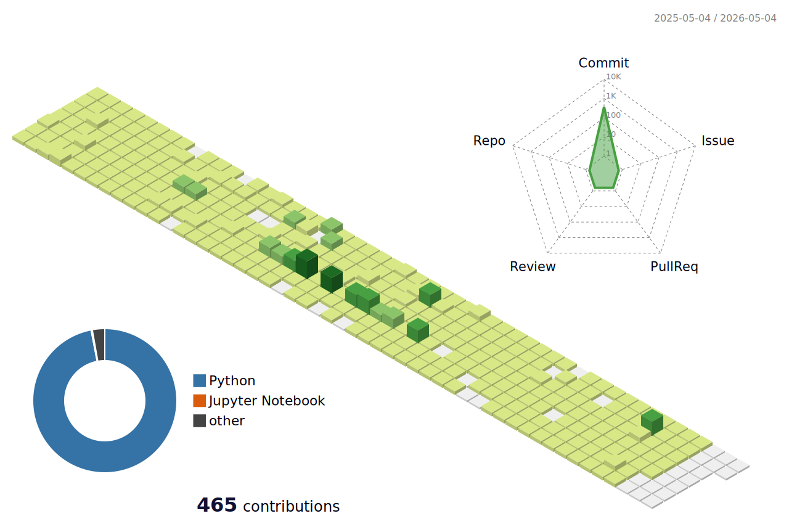

 

<h3 align="center">🛠 Tech Stack 🛠</h3>

  <b>📚 Languages 📚</b> 
  
  
  
  
  
  

  <b>📊 Data Science 📊</b> 
  
  
  
  
  

  <b>🌐 Web, Database & Tools 🌐</b> 
  
  
  
  
   
  
  
  
   
  
  
  

<h3 align="center">🏆 Algorithm Solving 🏆</h3>

  

